# 实验环境

- Machine:  x86_64
- Host OS:  Windows 10 Professional 21H2
- Prod OS:  Arch Linux 5.10.102.1-microsoft-standard-WSL2
- CPU:      11th Gen Intel(R) Core(TM) i7-11800H @ 2.30GHz
- GPU:      NVIDIA GeForce RTX 3060 Laptop GPU
- Compiler: GCC 13.2.1

# 实验目的

1. 熟悉 Pthread 多线程并行编程，掌握临界区、信号量、互斥量等线程同步方法
2. 熟悉 OpenMP 多线程并行编程，掌握基于 OpenMP 的多线程应用程序开发，掌握 OpenMP 相关函数以及数据作用域机制、多线程同步机制等
3. 熟悉 MPI 多进程并行编程环境，掌握 MPI 编程基本函数及 MPI 点对点通信及集合通信函数用法，掌握 MPI 的主从模式及对等模式编程

# 斐波那契数列

## 实验内容

1. 采用 Pthread 多线程并行方法实现计算 fib(n) 的并行程序
2. 测试分析不同 n 值和线程数 P 时的程序运行时间和并行效率
3. 测试并比较不同的线程同步方法对性能的影响

## 实验步骤

### 实验分析与算法设计

计算 fib(n) 可以通过分治法实现，核心代码如下：

```c
void *worker(void *arg) {
  arg_fib *d = (arg_fib *)arg;
  const int n = d->n;
  if (n < 2) {
    d->result = n;
    return nullptr;
  }
  arg_fib d_lhs = {
      .n = n - 2,
      .result = 0,
  };
  arg_fib d_rhs = {
      .n = n - 1,
      .result = 0,
  };
  pthread_t t_lhs, t_rhs;
  pthread_create(&t_lhs, nullptr, worker, &d_lhs);
  pthread_create(&t_rhs, nullptr, worker, &d_rhs);
  pthread_join(t_lhs, nullptr);
  pthread_join(t_rhs, nullptr);
  d->result = d_lhs.result + d_rhs.result;
  return nullptr;
}
```

但是考虑到该方法各线程不存在数据依赖，线程数也难以控制，创建线程的额外开销更是远大于一个串行的递归实现。

故该设计并不适用于本实验。

在此基础上，为了确保实验内容均被涉及，本实验应当被理解为计算 fib 数列直到第 n 项而非计算第 n 项 fib 数。

故考虑设计为：多线程竞争计算 fib(i) 直到 fib(n) 完成计算。

核心代码如下：

```c
void *worker(void *arg) {
  arg_fib *d = (arg_fib *)arg;
  while (true) {
    acquire_lock();
    if (d->index > ARG_FIB_N) {
      release_lock();
      break;
    }
    const int n = d->index;
    d->seq[n] = d->seq[n - 1] + d->seq[n - 2];
    d->index++;
    release_lock();
  }
  return nullptr;
}
```

但很显然，这样的实现使得其退化为了一个比同算法串行版本更慢的串行程序。

递推易得 `fib(n) = fib(i + 1) * fib(n - i) + fib(i) * fib(n - i - 1)` (公式 1)，故稍作修改使得更多线程可以同时参与数列计算：

```c
void *worker(void *arg) {
  arg_fib *d = (arg_fib *)arg;
  while (true) {
    acquire_lock();
    if (d->task_index > ARG_FIB_N) {
      release_lock();
      break;
    }
    const int n = d->task_index++;
    const int m = d->data_index;
    const int t = n - m;
    const bool ready = t + 1 <= m;
    if (ready) {
      release_lock();
    }
    d->seq[n] = d->seq[t + 1] * d->seq[n - t] + d->seq[t] * d->seq[n - t - 1];
    if (ready) {
      acquire_lock();
    }
    while (true) {
      if (d->data_index + 1 == n) {
        d->data_index = n;
        break;
      }
      release_lock();
      sched_yield();
      acquire_lock();
    }
    release_lock();
  }
  return nullptr;
}
```

在该实现中，m 指代 0\~m 的计算任务已经完成，每个线程互斥地获取 fib(n) 的计算任务，该计算任务依赖于 fib 前 max{m, n-m+1} 项，故若 n-m+1≤m，则剩余线程仍可继续获取计算任务，否则已经完成的结果不足以支持更多计算任务的执行，剩余线程必须同步等待当前计算任务的完成。

当多个计算任务结束时，线程必须同步地顺序更新 m 以确保计算任务分配的正确性。

此外，方便起见，未处理大数运算而任由计算结果溢出。

### 主线程设计

包含工作线程创建与运行时间测量，其中 **公式 1** 在 n≥3 时成立，故需初始化 fib 数列前三项。

```c
void fib_seq(arg_fib *d) {
  pthread_t threads[NR_THREADS] = {};
  for (int i = 0; i < NR_THREADS; ++i) {
    pthread_create(&threads[i], nullptr, worker, d);
  }
  for (int i = 0; i < NR_THREADS; ++i) {
    pthread_join(threads[i], nullptr);
  }
}

int main(int argc, char *argv[]) {
  using clock = std::chrono::high_resolution_clock;
  lock_init();
  const auto beg = clock::now();
  arg_fib d = {
      .seq = {0, 1, 1},
      .task_index = 3,
      .data_index = 2,
  };
  fib_seq(&d);
  const auto end = clock::now();
  std::cout << "fib(" << ARG_FIB_N << ") = " << d.seq[ARG_FIB_N] << " cost "
            << std::chrono::duration_cast<std::chrono::microseconds>(end - beg)
                   .count()
            << " us" << std::endl;
  return 0;
}
```

### 算法分析

本实验内容为 CPU 多线程的计算密集型任务，且具有计算复杂度低，数据依赖强的特征。

在这样的情形下，本身 CPU 并行效率就被核心线程数限制，理想情况下，当线程数 P 大于等于核心线程数时，并发情形增多。

但无论是并行还是并发，由于计算任务本身开销极低，这就导致为了处理数据依赖的互斥/同步操作的开销显得极重。

可以预料到在当前算法（空间换时间的迭代算法）中，并行化设计不但不会对性能带来提升，反而会随着线程数的增加而使其显著降低。

故至少在 CPU 多线程场景中，该算法下的 fibnacci 可能并不适合成为一个案例，但另一个矩阵快速幂的实现却完全能够胜任。

而在同样的任务特征下，类似的框架应当应用于开销更大的计算任务方才能有效发挥并行计算的优势。

## 实验结果及分析

### 算法验证

取 N=1000000 P=16，通过 bottom 工具可以看到程序运行时，各 CPU 均处在较高负载状态，可以验证程序执行的并行性。

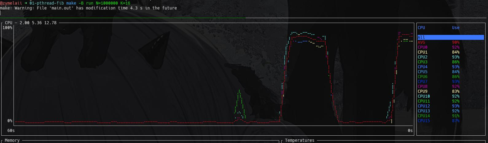

取 N=16，P={1,2,4,8}，可以观察到已完成的计算达到 P 后，计算任务基本保持在 P 个线程上并行/并发执行。

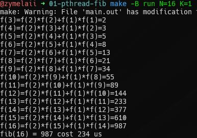
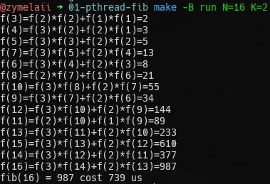
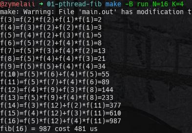
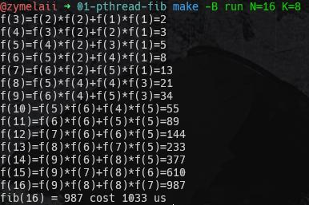

取 N=256 P=16，可以观察到程序并非顺序“串行”执行，而是在保持在至多 P 个计算任务上乱序执行。

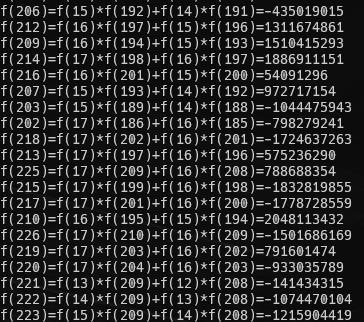

### 不同线程数的比较

取 N=1000000，统计不同线程数下的执行时间（更多数据在 DATA 中）。

| threads | time(us) |
| ------- | -------- |
| 1       | 29023    |
| 2       | 252703   |
| 4       | 1146282  |
| 8       | 3518219  |
| 16      | 5865207  |
| 24      | 7785217  |
| 32      | 22546321 |

CPU 线程数为 16，除去主线程后，理想情况下，P=15 时各工作线程均并行执行。

当 P=1 时，工作线程不需要等待同步，此时近似于串行程序。

以以上情况为标准，取 P=1 P=16 为边界，分别作 P=2..15 P=16..64 的曲线图。

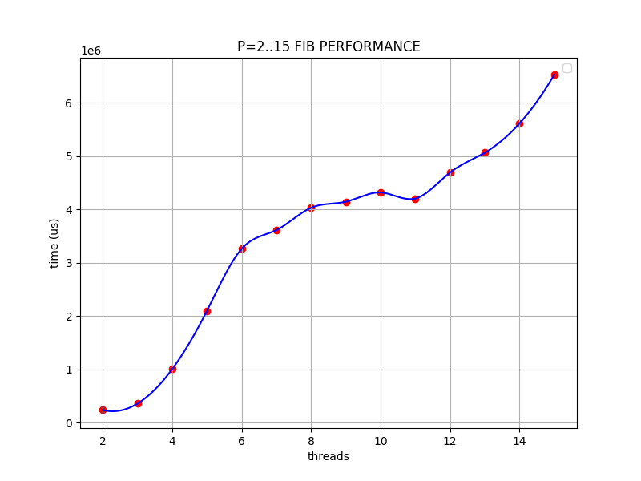

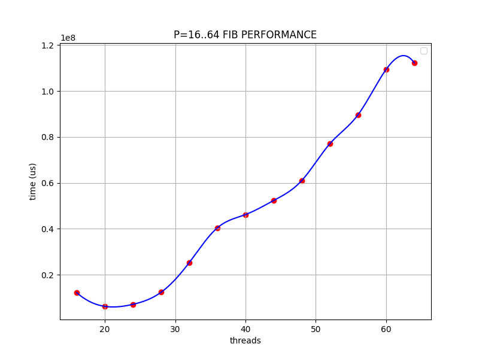

两种情形下，耗时均大致随着线程数线性增长，而后者的增长速度要明显快于前者。

对于前者，包括互斥的开销及 P 个计算任务的顺序同步；对于后者，额外附加了并发上下文切换的开销。


额外添加了 P=128 处的数据点，以验证增长确实大致呈线性。

### 不同计算规模的比较

取 P=4，统计不同计算规模下的执行时间。

| n       | time(us) |
| ------- | -------- |
| 100000  | 135528   |
| 200000  | 237202   |
| 300000  | 303853   |
| 1000000 | 952694   |
| 2000000 | 1908202  |

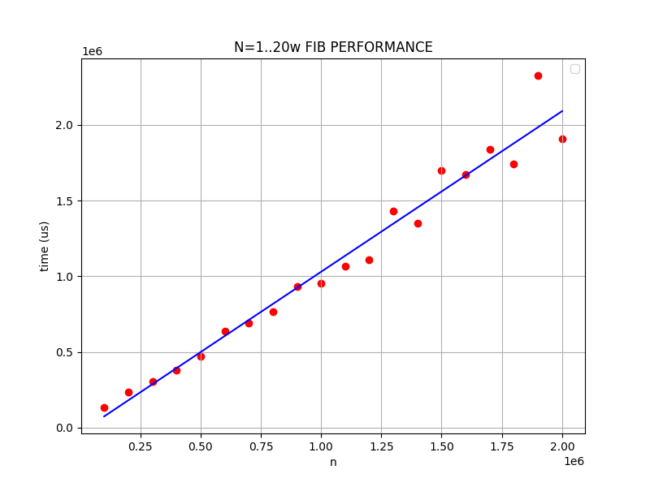

取 P=12，统计不同计算规模下的执行时间。

| n       | time(us) |
| ------- | -------- |
| 100000  | 135528   |
| 200000  | 237202   |
| 300000  | 303853   |
| 1000000 | 952694   |
| 2000000 | 1908202  |

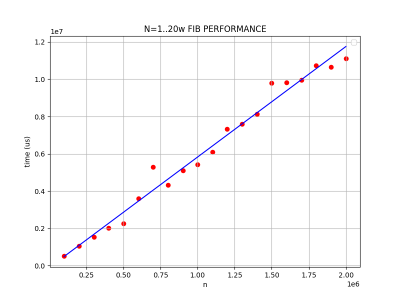

可以观察到无论是 P=4 还是 P=12，计算耗时均随计算规模线性增加，与计算使用的算法的复杂度一致。说明该并行化算法具有可拓展性。

### 不同同步原语的使用

以上数据结果均使用互斥锁得出，以 P=12 N=1..20w 为标准，作自旋锁的耗时曲线图。

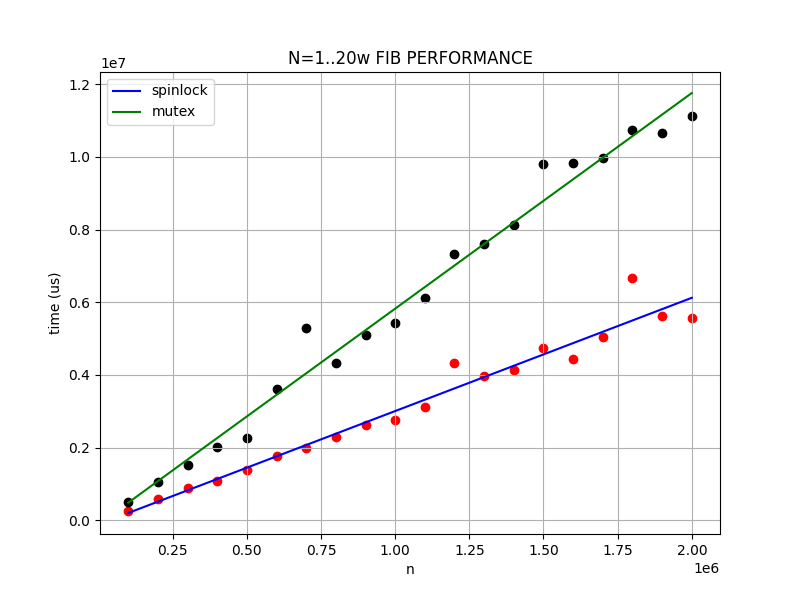

可以观察到该情形下自旋锁的表现要好于互斥锁。在该场景中，临界区中仅作简单计算，快进快出，故作为乐观锁的自旋锁要比互斥锁更适合。与之相对，互斥锁在该场景中会频繁地导致线程休眠与唤醒，高昂的上下文切换成本使得其性能显著下降。

# Floyd 算法的并行化

## 实验内容

1. 设计并实现 Floyd 的 OpenMP 或 MPI 并行程序，要求：
   1. 进/线程 p-1 负责读入和分发矩阵数据
   2. 矩阵行数 n 可以被进/线程数 P 整除，采用按行分块的方案
   3. 所有进/线程依次将结果数据写入数据文件，进/线程 0 先写，进/线程 1 再写，进/线程 p-1 最后写，最终完成结果输出
2. 分析不同 n 值、P 值以及不同矩阵稠密度时算法的运行时间，进行算法并行性能和可扩展性分析

## 实验步骤

### 算法设计

floyd 取遍中继点 k 松弛每一对顶点之间的距离，故取 k 分块作并行化并不能保证算法的正确性。

按照实验要求，将矩阵按行分块并对松弛操作的第一重循环作并行化，其中应当确保同时只有一趟松弛操作，即只对单个中继点 k 操作，方便起见，此处使用 barriar 顺序取遍 k。

```cpp
const int beg_row = tid * N / NR_THREADS;
const int end_row = (tid + 1) * N / NR_THREADS;

for (int k = 0; k < N; ++k) {
  #pragma omp barrier
  for (int i = beg_row; i < end_row; i++) {
    for (int j = 0; j < N; ++j) {
      if ((*mat)[i][k] != INF && (*mat)[k][j] != INF &&
          (*mat)[i][j] > (*mat)[i][k] + (*mat)[k][j]) {
        (*mat)[i][j] = (*mat)[i][k] + (*mat)[k][j];
      }
    }
  }
}
```

### 准备工作与 IO 要求

对于要求 `进/线程 p-1 负责读入和分发矩阵数据`，取 tid = P - 1 并使用 barriar 同步完成。

```cpp
const int tid = omp_get_thread_num();
if (tid == NR_THREADS - 1) {
  read_and_distribute_graph(*mat);
}
#pragma omp barrier
```

对于要求 `所有进/线程依次将结果数据写入数据文件...`，顺序取遍线程并使用 barriar 确保结果顺序输出。

```cpp
for (int id = 0; id < NR_THREADS; ++id) {
  if (tid == id) {
    std::ofstream of(DATOUT_FILE, std::ios::app);
    dump_rows(of, *mat, beg_row, end_row);
  }
  #pragma omp barrier
}
```

### 关于测量

为验证结果正确性，同时取串行 floyd 结果输出到 floyd-expect.dat，对应的并行结果输出到 floyd-result.dat。

考虑到规模较大时串行运行时长过长，对其作（可选的）2s 超时限制。

输入参数分别取 K N D，分别对应 OpenMP 线程数、数据规模乘数、矩阵稠密度。

其中数据规模（顶点数）为 N' = K * N，这样设计是为了保证 K 整除 N'。

时间测量取运行时间与 IO 时间的总计时长。

## 实验结果及分析

运行示例，详情见 Makefile。

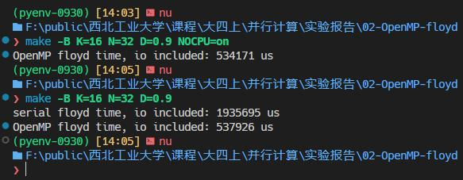

并行算法正确性：

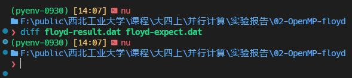

### 不同线程数的比较

取 N'=512 K=2^i D=0.3 i=1..9。

| P   | time(us) |
| --- | -------- |
| 1   | 2016920  |
| 2   | 1116625  |
| 4   | 724105   |
| 8   | 603265   |
| 16  | 570804   |
| 32  | 658540   |
| 64  | 606005   |
| 128 | 624083   |
| 256 | 726965   |
| 512 | 961149   |

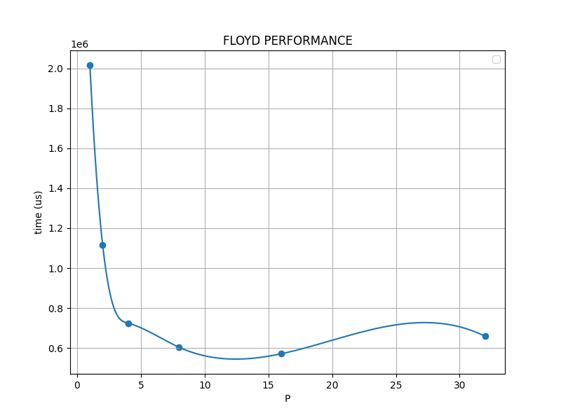

与此同时，串行耗时均值 1953514us。

线程数为 1 时，串并行差距不大，当线程增加时耗时明显减少，在这之后逐渐平缓；在超过 CPU 线程数 16 时性能出现反弹，耗时略微增加。

### 不同数据规模的比较

取 N=1..256 K=8 D=0.3，禁用 IO，禁用 CPU。

| n    | time(us) |
| ---- | -------- |
| 8    | 1570     |
| 16   | 1630     |
| 32   | 2527     |
| 64   | 6053     |
| 128  | 22400    |
| 256  | 110293   |
| 512  | 571237   |
| 1024 | 3854267  |
| 2048 | 27806321 |

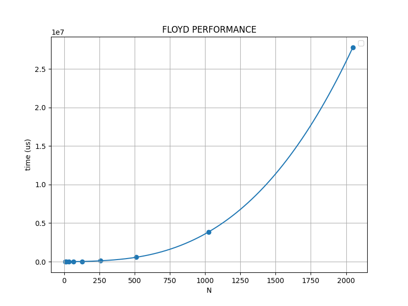

考虑到 Floyd 为 O(n^3) 算法，对耗时取立方根，得到：

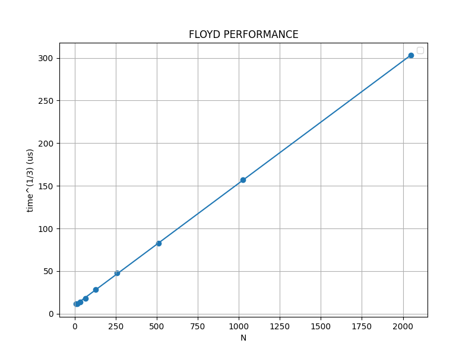

可知耗时如算法设计的预期随着 N^3 线性增长。

### 不同稠密度的比较

取 N=64 K=8 D=0..1，禁用 IO，禁用 CPU。

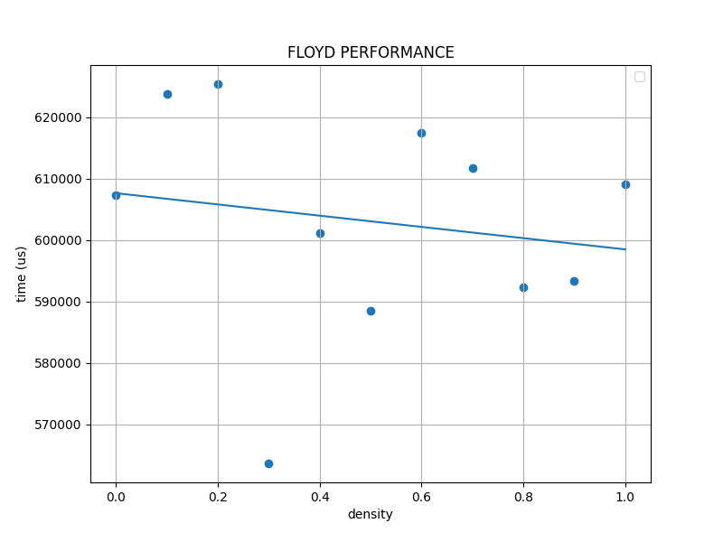

无显著关系。

重复实验取均值：

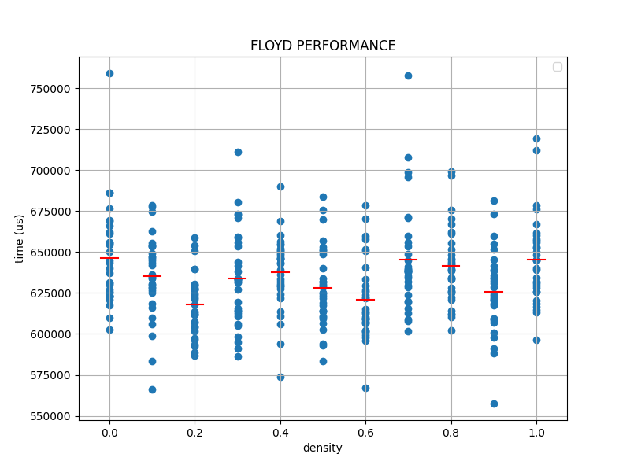

依旧无显著关系。

综合规模与稠密度变化，可说明该算法具有可拓展性。

# 并行 k-means 算法

## 实验内容

1. 设计并实现计算 k-means 的 OpenMP 或 MPI 并行程序
2. 测试并分析并行程序的时间性能

## 实验步骤

### 算法设计

K-means 算法步骤大致可以描述为：

1. 随机选定 k 个初始质心以划分出 k 簇
2. 为所有样本选中最近簇
3. 更新簇质心
4. 重复 2-3 直至簇不再变化或达到最大迭代次数

不难得到并行化的切入点可以在于最近簇计算与簇质心更新。

设计代码如下：

```cpp
void kmeans(int iters, std::vector<clus_t> &clusters) {
#pragma omp parallel num_threads(NR_THREADS)
  {
    for (int iter = 0; iter < iters; ++iter) {
#pragma omp for
      for (int i = 0; i < data.size(); ++i) {
        const int nearest_clus = find_nearest_clus(i, clusters);
#pragma omp critical
        { clusters[nearest_clus].clus_ids.push_back(i); }
      }
#pragma omp for
      for (int i = 0; i < clusters.size(); ++i) {
        if (!clusters[i].clus_ids.empty()) {
          update_centroid(clusters[i]);
        }
      }
#pragma omp for
      for (int i = 0; i < clusters.size(); ++i) {
        clusters[i].clus_ids.clear();
      }
    }
#pragma omp barrier
  }
}
```

其中最近簇计算与质心更新的部分由 OpenMP 从指定的线程自由中划分调度执行，仅需确保临界区簇集合的更新被线程独占。

### 验证部分

选定簇中最多的样本类型作为该簇的类型，使用 purity 评估 k-means 结果的正确性：

```cpp
void predict_clus_class(clus_t &clus) {
  std::map<std::string, int> class_cnt;
  for (const int i : clus.clus_ids) {
    if (class_cnt.count(data[i].type)) {
      ++class_cnt[data[i].type];
    } else {
      class_cnt[data[i].type] = 1;
    }
  }
  clus.centroid.type.clear();
  int max_cnt = 0;
  for (const auto &[class_name, count] : class_cnt) {
    if (count > max_cnt) {
      clus.centroid.type = class_name;
      max_cnt = count;
    }
  }
}

void predict(std::vector<clus_t> &clusters) {
#pragma omp parallel num_threads(NR_THREADS)
  {
#pragma omp for
    for (int i = 0; i < data.size(); ++i) {
      const int nearest_clus = find_nearest_clus(i, clusters);
#pragma omp critical
      { clusters[nearest_clus].clus_ids.push_back(i); }
    }
#pragma omp for
    for (int i = 0; i < clusters.size(); ++i) {
      predict_clus_class(clusters[i]);
    }
  }
}
```

## 实验结果及分析

本例中使用 iris 数据集作为数据输入，该数据集包括 3 个类别。

此处默认置 3 个簇以便于验证，并尝试变更簇数、迭代次数以分析可拓展性。

> 此处使用了训练样本集 iris 作为测试集，显然这问题很大，但出于时间等因素的考虑就先不改了。

### 不同迭代次数的比较

取 P=12 K=3 N=1..1000，得到结果如下：

| N     | purity | time(us) |
| ----- | ------ | -------- |
| 1     | 0.8267 | 11156    |
| 2     | 0.8733 | 19467    |
| 3     | 0.9000 | 11036    |
| 4     | 0.9000 | 10248    |
| 16    | 0.8867 | 16116    |
| 64    | 0.8867 | 16600    |
| 256   | 0.8867 | 27907    |
| 1024  | 0.8867 | 44416    |
| 65536 | 0.8867 | 2875296  |

在第 16 趟时，聚类结果已基本收敛为如下结果：

```plain
cluster "Iris-virginica" has 39 data points
cluster "Iris-versicolor" has 61 data points
cluster "Iris-setosa" has 50 data points
```

可以观察到算法运行时间与迭代趟数基本呈线性关系。

### 不同簇数的比较

取 P=12 N=1024 K=1..8，得到结果如下：

| K   | purity | time(us) |
| --- | ------ | -------- |
| 1   | 0.3333 | 51365    |
| 2   | 0.6667 | 52581    |
| 3   | 0.8867 | 42884    |
| 4   | 0.8800 | 54300    |
| 5   | 0.8800 | 57427    |
| 6   | 0.8867 | 59001    |
| 7   | 0.8867 | 45292    |
| 8   | 0.8867 | 46104    |

当簇数增加时，purity 会逐渐趋向于 1.00，取 K=64 可得结果 0.9733，符合这一预期。

### 串并行时间比较

取 P=12 K=3 N=2^i i=10..16，得到结果如下：

| N       | omp time(us) | no-omp time(us) | time ratio |
| ------- | ------------ | --------------- | ---------- |
| 1024    | 45544        | 63460           | 0.7176     |
| 2048    | 95085        | 131752          | 0.7217     |
| 4096    | 169744       | 261987          | 0.6979     |
| 8192    | 365173       | 500429          | 0.7297     |
| 16384   | 690759       | 984919          | 0.7013     |
| 32768   | 1403419      | 1963140         | 0.7148     |
| 65536   | 2760551      | 3997876         | 0.6905     |
| 1000000 | 45089438     | 68360436        | 0.6595     |

相对于串行实现，并行版本存在明显优势。而当迭代次数/簇数增加时，这种优势会更为明显。
