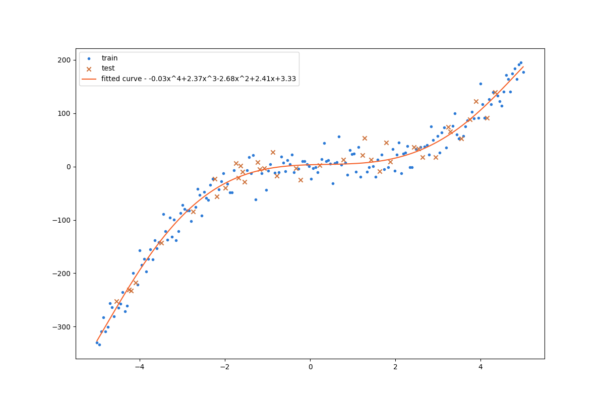

# 任务说明

多项式回归是一种回归分析形式，在这种形式中，自变量 x 与因变量 y 之间的关系被建模为 n 阶多项式。使用机器学习的方法来创建一个多项式回归模型，改模型可以根据给定的数据集预测结果。数据集由自变量 x 和因变量 y 组成，本次作业的任务为找到一个多项式，能最好地描述 x 和 y 之间的关系。

# 关于数据集

本实验选取的数据集包含 200 个样本点，每个样本具有一个自变量 x 和一个因变量 y。数据集根据 4:1 的比例划分为训练集和测试集。

# 方法简介

1. 画出训练集的散点图，估计多项式的阶数范围
2. 使用最小二乘法对 n 阶多项式进行拟合，计算模型在测试集上的预测值与真实值的均方误差 MSE 作为评估模型好坏的指标
3. 选取 MSE 最小的模型作为最终模型

# 实验结果

在阶数 3 到 10 中搜索，得到最优拟合结果为阶数 7 的多项式，均方误差 MSE 为 298.89397603619886，多项式系数如下：

| term  |      coefficient       |
| :---: | :--------------------: |
| $x^0$ |   3.338797113525125    |
| $x^1$ |   2.4124260570549767   |
| $x^2$ |   -2.688587760322067   |
| $x^3$ |   2.3789813766740306   |
| $x^4$ | -0.033335645885624196  |
| $x^5$ | -0.0019585624373076923 |
| $x^6$ | 0.0009466539388366987  |
| $x^7$ | -0.0005952962546293371 |

使用拟合的模型对测试集进行预测评估，得到 $R^2$ 为 0.9626951342326144，对应结果如下：

# 遇到的问题及解决方法

**问题**

使用训练后的模型在训练集上预测值与真实值的均方误差评估模型性能时，高阶多项式总是会得到更低的 MSE，从而造成模型的过拟合。

**方案**

1. 使用测试集的预测结果与真实值的 MSE 作为评估指标
2. 将训练集进一步划分为验证集和训练集，在训练集上训练，在验证集上评估 MSE
3. 在训练集上作 k-fold 交叉验证，用 k 次训练评估的分数的均值作为该 n 阶模型的评估指标
