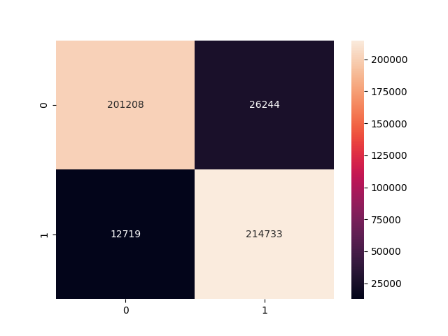
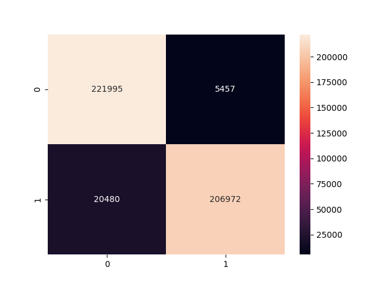

# 任务说明

使用贝叶斯估计或最大似然估计 MLE 来预测信用卡交易记录是正常还是欺诈。

# 关于数据集

本实验采用的数据集为 [Kaggle Credit Card Fraud Detection](https://www.kaggle.com/datasets/mlg-ulb/creditcardfraud)，即信用卡欺诈检测数据集。信用卡欺诈检测数据集是一个经典的二分类数据集，包含信用卡交易记录。该数据集包含 284807 笔交易，其中 492 笔是欺诈交易（正样本），其余为正常交易（负样本）。每个样本由 30 个特征以及 1 个标签 Class 组成，Class 为 0 表示正常交易，为 1 表示欺诈交易。

# 方法简介

观察训练集的数据集，可以发现每条记录由 28 个匿名特征值、1 个具名特征 Amount 与标签 Class 构成。

其中匿名特征值的分布较均匀且普遍集中在区间 (-1, 1) 内，不存在远超出此范围的特征值。

具名特征 Amount 的值极为分散，进行计算后得到最小值 0 最大值 19656.53 均值 88.51，差异相较于匿名特征过大，需在预处理过程进行标准化。

对正负样本的分布进行统计，得到负样本 227452 个，正样本 393 个，样本比例严重失衡，训练出的模型容易偏向于预测出负样本，对模型的表现有较大影响，需要进行过采样对样本进行均衡。

针对任务要求，分别选用 MLE 原理的逻辑斯蒂回归和错误驱动的感知机模型对记录进行预测，其中后者用于对比观察逻辑斯蒂回归在高维数据二分类上的效果。

综上完整的实验方法设计如下：

1. 对特征进行标准化
2. 使用 SMOTE 方法对样本进行过采样，确保正负样本分布均匀
3. 分别使用逻辑斯蒂回归与感知机模型进行训练与预测

# 实验结果

使用 SMOTE 进行过采样后正负样本均为 227452 个。

使用感知机进行训练并在训练集上进行评估，其准确率为 91.43%；其中负样本精确度 0.94，召回率 0.88，F1 分数 0.91，正样本精确度 0.89，召回率 0.94，F1 分数 0.92。

使用逻辑斯蒂回归进行训练并在训练集上进行评估，其准确率为 94.30%，ROC-AUC 分数为 0.9871；其中负样本精确度 0.92，召回率 0.98，F1 分数 为 0.94，正样本精确度 0.97，召回率 0.91，F1 分数 为 0.94。

综合来看，在欺诈检测数据集上逻辑斯蒂模型拥有比感知机更好的表现，且对于正样本的检测精确度极高，但另一方面，该模型在正样本的召回率上却显得不足，选择感知机模型能够判断出更多对欺诈交易正样本。

在缺少各方面指标都更优秀的模型的情况下，选择逻辑斯蒂模型在保证较高检测率的同时能保持较低的误报率，人工审查成本低，但需承担欺诈交易发生的风险；选择感知机模型能够更好地避免遗漏欺诈交易，但误报率较高，人工审查成本低，可能导致用户流失。

由于实际场景中正样本的数量要远低于负样本，正样本的召回率的影响较小，而对于正样本分类的精确度的要求较高，故而在二者中选用逻辑斯蒂回归训练出的模型更为合适。不过，更为合适的流程也可以构造成先使用高召回率的感知机模型进行判别，再将可疑的正样本交易送入高精确度的逻辑斯蒂模型进行二次判别，从而实现 1+1>1 的效果。

# 遇到的问题及解决方法

**问题**

特征 Amount 的量级过大，主导模型训练，最终模型效果极差

> 如 Perceptron 在数据不处理时仅有 65.14% 准确率

**方案**

对特征进行标准化

**问题**

正负样本数差异过大

**方案**

过采样
